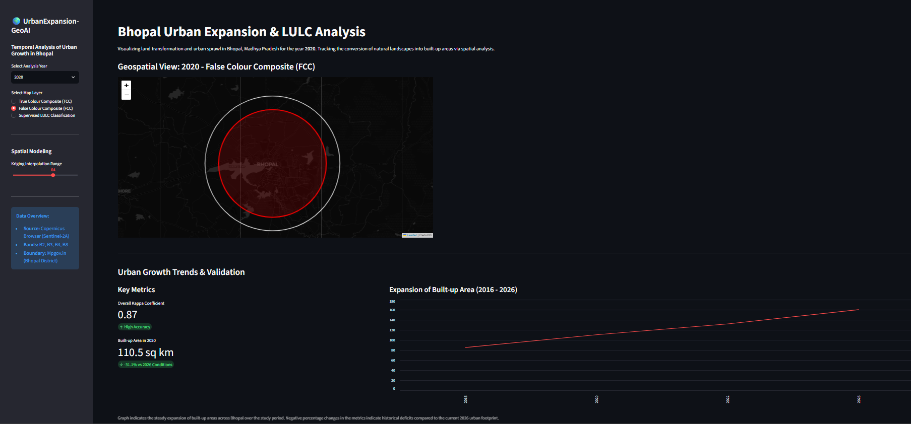

# 🌍 UrbanExpansion-GeoAI

> **Assessing the variation and impact of rapid urbanisation on ecological zones using geospatial analysis and remote sensing.**[cite: 1]

---

## 📖 Project Overview

Urbanisation is the continuous conversion of natural and rural landscapes into built-up areas, driven by population growth and development needs[cite: 1]. This project provides a comprehensive temporal analysis of urban expansion in Bhopal, Madhya Pradesh, mapping spatial changes across the years **2016, 2020, 2022, and 2026**[cite: 1].

Bhopal faces unique ecological challenges due to its sensitive natural features, such as expansive lakes and vital green zones[cite: 1]. By leveraging Geographic Information Systems (GIS) and remote sensing, this repository tracks land transformation over time to support sustainable urban planning and efficient land management[cite: 1].

---

## ✨ Key Features

*   **Multi-Temporal Change Detection:** Analyzes shifts in Land Use and Land Cover (LULC) over a decade[cite: 1].
*   **High-Resolution Satellite Imagery:** Utilizes multi-temporal Sentinel-2A satellite data (Bands 2, 3, 4, 8) sourced via the Copernicus Browser[cite: 1].
*   **Supervised Classification:** Implements the Maximum Likelihood Method to categorize landscapes into built-up areas, vegetation, water bodies, agricultural, and barren land[cite: 1].
*   **Statistical Validation:** Evaluates classification accuracy using the Kappa Coefficient[cite: 1].

## 🛠️ Technology Stack

*   **GIS Platform:** ArcGIS Pro[cite: 1]
*   **Satellite Data:** Sentinel-2A (Multi-spectral)[cite: 1]
*   **Classification Algorithm:** Maximum Likelihood Supervised Classification[cite: 1]
*   **Boundary Data Sourcing:** Mpgov.in[cite: 1]

## 🗺️ Methodology Workflow

The project pipeline is systematically divided into three core phases to ensure accuracy and consistency[cite: 1]:

| Phase | Operations & Geoprocessing Tools | Objective |
| :--- | :--- | :--- |
| **A. Data Preparation** | Band Compositing (B2, B3, B4, B8), Mosaicing (*Mosaic to New Raster*), and Clipping (*Extract by Mask*) using Bhopal's administrative boundary[cite: 1]. | To prepare localized, analysis-ready True (TCC) and False Colour Composites (FCC)[cite: 1]. |
| **B. Image Processing** | Class-wise training sample selection and execution of Supervised Classification[cite: 1]. | To achieve accurate, pixel-based categorization of LULC classes[cite: 1]. |
| **C. Analysis & Output** | Temporal change detection mapping (2016 $\rightarrow$ 2026), area calculation for each class, and Kappa Coefficient evaluation[cite: 1]. | To quantify urban sprawl patterns, expansion direction, and environmental impact[cite: 1]. |

## 🚀 Future Scope & Enhancements

To further scale this analysis and improve classification accuracy, the following advanced integrations can be explored:
*   **Automated Geoprocessing:** Transition manual ArcGIS workflows into automated scripts using **Python (ArcPy)** for seamless, programmatic multi-year spatial analysis.
*   **Advanced Deep Learning:** Replace traditional Maximum Likelihood with robust machine learning and neural network architectures, such as **Support Vector Machines (SVM)** or **Multi-Layer Perceptrons (MLP)**, for superior extraction of complex urban footprints.
*   **Fuzzy Logic Integration:** Implement **Fuzzy C-Means (FCM)** clustering to better handle mixed-pixel phenomena at the edges of shrinking water bodies and rapidly expanding built-up zones.
*   **Spatial Modeling:** Apply geostatistical interpolation techniques, like Kriging, alongside temporal data to model and predict future urban sprawl directions probabilistically.

## 👨‍🔬 Authors and Acknowledgements

*   **Author:** Ishpreet Singh (Roll No: 25M0326)[cite: 1]
*   **Supervision:** Prof. Anil Kumar Dikshit[cite: 1]
*   **Institution:** Environmental Science and Engineering Department, Indian Institute of Technology Bombay (IIT Bombay), Powai, Mumbai – 400076[cite: 1]

---
*Built for sustainable urban management through the power of GeoAI.*
